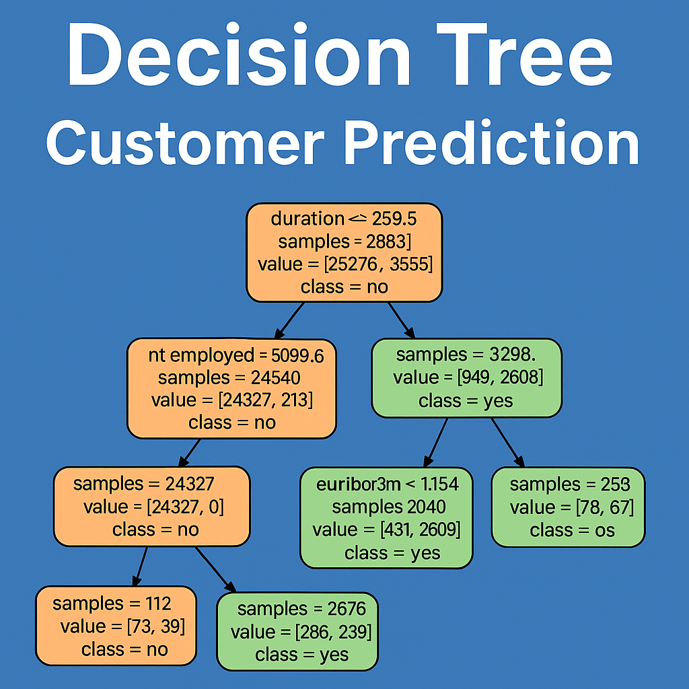
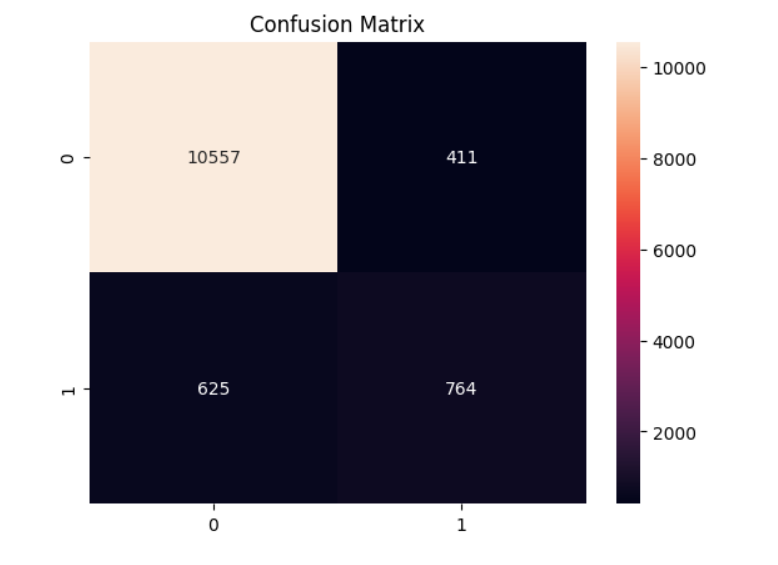
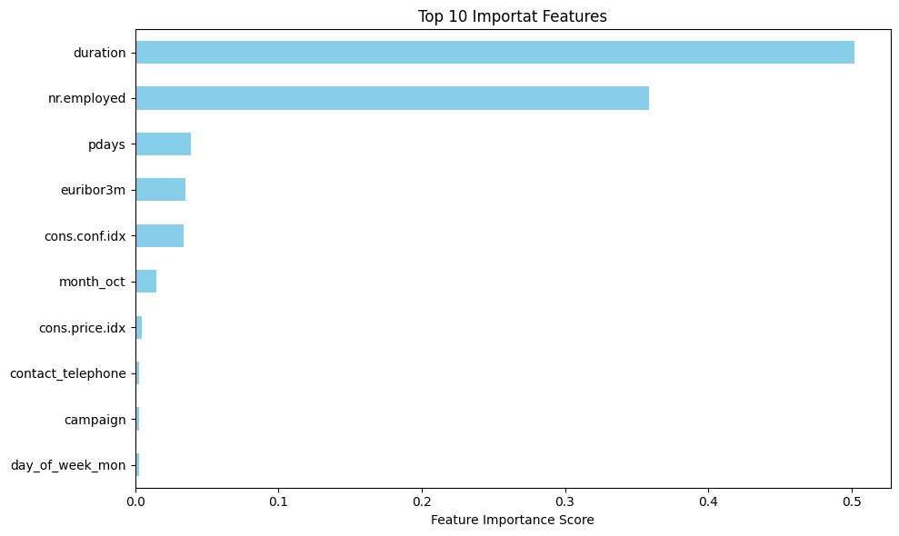

#  Customer Purchase Prediction using Decision Tree
This is a learning project for building a Decision Tree Classifier using the UCI Bank Marketing Dataset to predict whether a customer will subscribe to a term deposit.

##  Table of Contents
- [Overview](#overview)
- [Dataset](#dataset)
- [Tools and Technologies](#tools-and-technologies)
- [Steps Involved](#steps-involved)
- [Modeling](#modeling)
- [Evaluation](#evaluation)
- [Visualizations](#visualizations)
- [Key Learnings](#key-learnings)
- [How to Use](#how-to-use)
- [License](#license)

##  Overview
This project focuses on a classification problem using supervised learning. The goal is to identify whether a bank client will subscribe to a term deposit based on their personal, contact, and campaign-related attributes.


##  Dataset
- [Bank Marketing Dataset - UCI ML Repository](https://archive.ics.uci.edu/ml/datasets/bank+marketing)
- File used: `bank-additional-full.csv`

##  Tools and Technologies

- **Programming Language**: Python
- **Libraries**: 
  - pandas
  - numpy
  - matplotlib
  - seaborn
  - scikit-learn
- **Model**: DecisionTreeClassifier (from sklearn)

##  Steps Involved
1. Data Loading and Exploration
2. One-Hot Encoding for categorical variables
3. Train/Test Split
4. Decision Tree Model Training
5. Evaluation (Accuracy, Confusion Matrix, Classification Report)
6. Visualization of the Tree and Feature Importance

##  Modeling

- Used `DecisionTreeClassifier` from `sklearn.tree`
- Limited tree depth using `max_depth=5` to avoid overfitting
- Trained on 70% of the data and tested on 30%
- Feature importance was extracted to understand which variables influenced the model most

##  Evaluation

- **Accuracy**: 92%
- **Precision, Recall, F1-Score**:
  - Precision: 0.65
  - Recall: 0.55
  - F1 Score: 0.60
  - 
- **Confusion Matrix**: See visualization section below

  ##  Visualizations
- Decision Tree structure (simplified with max_depth=5)
- Confusion matrix heatmap
- Top 10 features bar chart based on feature importance
- 
  
##  Key Learnings
- Preprocessing real-world categorical data
- Splitting data to avoid overfitting
- Understanding how decision trees work internally
- Visualizing the decision-making process

##  How to Use
1. Clone this repository:git clone https://github.com/Divya-Rag/Decision-Tree-Customer-Prediction.git
2. Open the notebook:
Task_3_Decision_Tree_Customer_Prediction.ipynb
3. Run it in Jupyter Notebook or Google Colab (recommended)
4. Make sure to have required libraries installed:
```bash
pip install pandas numpy matplotlib seaborn scikit-learn

## License
This project is licensed under the MIT License. See the LICENSE file for details.
Let me know if you'd like me to update this with your actual evaluation metrics or insert the image markdown for your confusion matrix and feature importance visuals!


Feel free to clone, explore, and improve!

